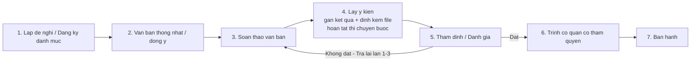

# Quy trinh soan thao van ban 7 buoc

## Nguyen tac thiet ke

- Quy trinh duoc cau hinh bang danh muc, khong hard-code 7 buoc.
- Moi buoc co the khai bao cach hoan thanh, dieu kien chuyen buoc va so lan tra lai toi da.
- Buoc `Lay y kien` luu noi dung yeu cau, noi dung phan hoi, han phan hoi va nhom file dinh kem.
- Buoc `Danh gia/Tham dinh` cho phep tra lai don vi soan thao toi da 3 lan, moi lan deu luu lich su va file rieng.
- Khi can thay doi luong sau nay, chu yeu sua o bang cau hinh quy trinh va bang chuyen buoc.

## So do nghiep vu

## Anh xa du lieu chinh

- `DanhMucQuyTrinhSoanThaos`: cau hinh quy trinh tong.
- `DanhMucBuocQuyTrinhs`: cau hinh tung buoc.
- `DanhMucChuyenBuocQuyTrinhs`: cau hinh nhanh chuyen buoc.
- `HoSoVanBans`: ho so van ban dang chay theo quy trinh.
- `HoSoVanBanXuLys`: nhat ky xu ly theo buoc.
- `HoSoVanBanLayYKiens`: chi tiet lay y kien va file.
- `HoSoVanBanDanhGias`: ket qua tham dinh/danh gia tung lan.
- `HoSoVanBanPhanHoiDanhGias`: giai trinh cua don vi soan thao sau moi lan bi tra lai.
